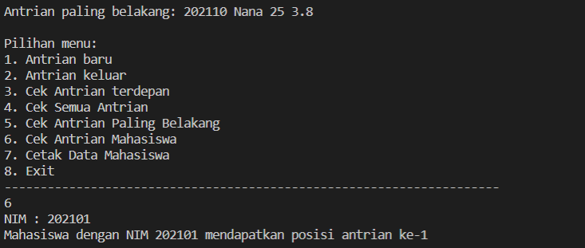

**Algoritma dan Struktur Data 2021-2022** 

**Nama : Andhito Galih Nur Cahyo**

**Kelas : 1F**

**No absen : 06**

**Nim : 2141720138**

**JOBSHEET VIII**

**QUEUE**

**8.1 Tujuan Praktikum**
Setelah melakukan materi praktikum ini, mahasiswa mampu:
1. Mengenal struktur data Queue
2. Membuat dan mendeklarasikan struktur data Queue
3. Menerapkan algoritma Queue dengan menggunakan array

**8.2 Praktikum 1**
Waktu percobaan : 45 menit
Pada percobaan ini, kita akan mengimplementasikan penggunaan class Queue.

**8.2.1 Langkah-langkah Percobaan**

**8.2.2 Verifikasi Hasil Percobaan**


**8.2.3 Pertanyaan**
1. Pada konstruktor, mengapa nilai awal atribut front dan rear bernilai -1, sementara atribut size 
bernilai 0?
2. Pada method Enqueue, jelaskan maksud dan kegunaan dari potongan kode berikut!
```
if (rear == max -1){
    rear = 0;
```
3. Pada method Dequeue, jelaskan maksud dan kegunaan dari potongan kode berikut!
```
if (Front == max -1){
    Front = 0;
```
4. Pada method print, mengapa pada proses perulangan variabel i tidak dimulai dari 0 (int i=0), 
melainkan int i=front?
5. Perhatikan kembali method print, jelaskan maksud dari potongan kode berikut!
```
i = (i +1)% max;
```
6. Tunjukkan potongan kode program yang merupakan queue overflow!

7. Pada saat terjadi queue overflow dan queue underflow, program tersebut tetap dapat berjalan 
dan hanya menampilkan teks informasi. Lakukan modifikasi program sehingga pada saat terjadi 
queue overflow dan queue underflow, program dihentikan!

**Jawaban:**

1. Karena Queue telah disettings dalam keadaan kosong. Nilai dari atribut front dan rear = -1 dimaksudkan supaya tidak terdapat dalam queue atau index array manapun.

2. Jika rear berada di index terakhir, maka rear di pindah ke index ke-0. Misal: max = 5, maka index dalam array dari 0-4, yang mana max - 1, yaitu 5-1 = 4 (index terakhir)

3. Jika front berada di index terakhir, maka front di pindah ke index ke-0. Misal: max = 5, maka index dalam array dari 0-4, yang mana max - 1, yaitu 5-1 = 4 (index terakhir)

4. Karena front tidak selalu ada di index ke-0.

5. Agar increament dari i nya itu sendiri maksimal sampai dengan jumlah max nya. Misal : jika max = 5, i = front = 4, maka (4+1)% 5 = 0. yang artinya jika nilai front itu ada pada index terakhir maka nanti akan bergeser ke index 0, bisa dikatakan juga potongan kode tersebut digunakan untuk membatasi dan mengarahkan ke index selanjutnya yang sesuai jumlah max.

6.  Overflow: kondisi yang dihasilkan dari mencoba menambahkan elemen ke queue yang sudah penuh

```
public boolean IsFull(){
        if(size == max){
            return true;
        }else{
            return false;
        }
    }

    public void Enqueue(int dt){
        if(IsFull()){
            System.out.println("Queue sudah penuh");
        }else{
            if(IsEmpty()){
                front = rear = 0;
            }else{
                if(rear == max - 1){
                    rear = 0;
                }else{
                    rear++;
                }
            }
            data[rear] = dt;
            size++;
        }
    }

```

7. - Overflow:

    Code:
```

public void Enqueue(int dt){ 
if(IsFull()){
System.exit(0); //  pada baris ini dilakukan modifikasi
         }else{
            if(IsEmpty()){
                 front = rear = 0;
             }else{
                 if(rear == max - 1){
                    rear = 0;
                 }else{
                     rear++;
                }
            }
             data[rear] = dt;
             size++;
         }
    }


```

Output:


Underflow:

Code:

```
public int Dequeue(){ 
    int dt = 0;
        if(IsEmpty()){
            System.exit(0); // pada baris ini dilakukan modifikasi
        }else{
             dt = data[front];
            if(IsEmpty()){
                front = rear = -1;
            }else{
                if(front == max - 1){
                front =0;
               }else{
                  front++;
                }
            }
        }
        return dt;
    }

```
     
Output:


        

**8.3 Praktikum 2**

**8.3.1 Langkah-langkah Percobaan**

**8.3.2 Verifikasi Hasil Percobaan**


**8.3.3 Pertanyaan**
1. Pada class QueueMain, jelaskan fungsi IF pada potongan kode program berikut!


2. Lakukan modifikasi program dengan menambahkan method baru bernama peekRear pada class 
Queue yang digunakan untuk mengecek antrian yang berada di posisi belakang! Tambahkan pula 
daftar menu 5. Cek Antrian paling belakang pada class QueueMain sehingga method peekRear
dapat dipanggil!

**Jawaban:**
1. Jika norek, nama, dan alamat tidak harus memperhatikan spasi, umur tidak sama dengan 0 dan saldo tidak sama dengan 0, maka akan mencetak Antrian yang keluar: norek, nama, alamat, saldo.

2. 
Code:


 
Output: 


**8.4 Tugas**
1. Tambahkan dua method berikut ke dalam class Queue pada Praktikum 1:
a. Method peekPosition(data: int) : void
Untuk menampilkan posisi dari sebuah data di dalam queue, misalnya dengan mengirimkan 
data tertentu, akan diketahui posisi (indeks) data tersebut berada di urutan ke berapa
b. Method peekAt(position: int) : void
Untuk menampilkan data yang berada pada posisi (indeks) tertentu
Sesuaikan daftar menu yang terdapat pada class QueueMain sehingga kedua method tersebut 
dapat dipanggil!
**Jawaban:**
 Code
```
public class Queue {
    int[] data;
    int front;
    int rear;
    int size;
    int max;

    public Queue(int n){
        max = n;
        data = new int[max];
        size = 0;
        front = rear = -1;
    }

    public boolean IsEmpty(){
        if(size == 0){
            return true;
        }else{
            return false;
        }
    }

    public boolean IsFull(){
        if(size == max){
            return true;
        }else{
            return false;
        }
    }

    public void peek(){
        if(!IsEmpty()){
            System.out.println("Elemen terdepan: " +data[front]);
        }else{
            System.out.println("Queue masih kosong");
        }
    }

    public void print(){
        if(IsEmpty()){
            System.out.println("Queue masih kosong");
        }else{
            int i = front;
            while (i != rear){
                System.out.print(data[i] + " ");
                i = (i+1) % max;
            }
            System.out.println(data[i] + " ");
            System.out.println("Jumlah elemen = " + size);
        }
    }

    public void clear(){
        if(!IsEmpty()){
            front = rear = -1;
            size = 0;
            System.out.println("Queue berhasil dikosongkan");
        }else{
            System.out.println("Queue masih kosong");
        }
    }

    public void Enqueue(int dt){
        if(IsFull()){
            System.out.println("Queue sudah penuh");
        }else{
            if(IsEmpty()){
                front = rear = 0;
            }else{
                if(rear == max - 1){
                    rear = 0;
                }else{
                    rear++;
                }
            }
            data[rear] = dt;
            size++;
        }
    }

    public int Dequeue(){
        int dt = 0;
        if(IsEmpty()){
            System.out.println("Queue masih kosong");
        }else{
            dt = data[front];
            size--;
            if(IsEmpty()){
                front = rear = -1;
            }else{
                if(front == max - 1){
                    front =0;
                }else{
                    front++;
                }
            }
        }
        return dt;
    }

    public int peekPosition(int data){
        int posisi = -1;
        if(!IsEmpty()){
            for(int j=0; j<this.data.length; j++){
                if(this.data[j] == data){
                    posisi = j;
                    break;
                }
            }
        }else{
            System.out.println("Queue masih kosong");
        }
        return posisi;
    }

    public void peekAt(int posisi){
        if(!IsEmpty()){
            if(posisi !=0){
                System.out.println("Data pada urutan ke-"+ (posisi) + " ialah "+data[posisi-1]);
            }
        }
    }

}

import java.util.Scanner;
class T1QueueMain{
    public static void menu(){
        System.out.println("Masukkan operasi yang diinginkan:");
        System.out.println("1. Enqueue");
        System.out.println("2. Dequeue");
        System.out.println("3. Print");
        System.out.println("4. Peek");
        System.out.println("5. Peek Position");
        System.out.println("6. Peek At");
        System.out.println("7. Clear");
        System.out.println("8. Exit");
        System.out.println("----------------------------------");
    }

    public static void main(String[] args) {
        Scanner sc = new Scanner(System.in);
        System.out.print("Masukkan kapasitas queue: ");
        int n = sc.nextInt();

        Queue Q = new Queue(n);
        int pilih;
        do{
            menu();
            pilih = sc.nextInt();
            switch(pilih){
                case 1:
                    System.out.print("Masukkan data baru: ");
                    int dataMasuk = sc.nextInt();
                    Q.Enqueue(dataMasuk);
                    break;
                case 2:
                    int dataKeluar = Q.Dequeue();
                    if(dataKeluar != 0){
                        System.out.println("Data yang dikeluarkan: "+ dataKeluar);
                        break;
                    }
                case 3:
                    Q.print();
                    break;
                case 4:
                    Q.peek();
                    break;
                case 5:
                    System.out.print("Masukkan data: ");
                    int cari = sc.nextInt();
                    int posisi = Q.peekPosition(cari);
                    if(posisi != -1){
                        System.out.println("Data " +cari + " berada di posisi urutan ke-"+(posisi+1));
                    }else{
                        System.out.println("Data tidak ditemukan!");
                    }
                    break;
                case 6:
                    System.out.print("Masukkan urutan data: ");
                    int dataCari = sc.nextInt();
                    Q.peekAt(dataCari);
                    break;
                case 7:
                    Q.clear();
                    break;
                case 8:
                System.out.println("TERIMA KASIH......");
                    System.exit(0);
                    break;
            }
        }while(pilih == 1 || pilih == 2 || pilih == 3 || pilih == 4 || pilih == 5 ||
               pilih == 6 || pilih == 7 || pilih == 8);
    }
}
```

 Output


2. Buatlah program antrian untuk mengilustasikan mahasiswa yang sedang meminta tanda tangan 
KRS pada dosen DPA di kampus. Ketika seorang mahasiswa akan mengantri, maka dia harus 
menuliskan terlebih dulu NIM, nama, absen, dan IPK seperti yang digambarkan pada Class 
diagram berikut:
**Jawaban:**
 Code
```
public class T2Mahasiswa {
    String nim, nama;
    int absen;
    double ipk;

    T2Mahasiswa(String nim, String nama, int absen, double ipk){
        this.nim = nim;
        this.nama = nama;
        this.absen = absen;
        this.ipk = ipk;
    }

    T2Mahasiswa(){

    }
}

class Queue {
    T2Mahasiswa[] data;
    int front;
    int rear;
    int size;
    int max;

    public Queue(int n){
        max = n;
        data = new T2Mahasiswa[max];
        size = 0;
        front = rear = -1;
    }

    public boolean IsEmpty(){
        if(size == 0){
            return true;
        }else{
            return false;
        }
    }

    public boolean IsFull(){
        if(size == max){
            return true;
        }else{
            return false;
        }
    }

    public void peek(){
        if(!IsEmpty()){
            System.out.println("Mahasiswa Antrian terdepan: " + data[front].nim + " " + data[front].nama + " " + 
            data[front].absen + " " + data[front].ipk);
        }else{
            System.out.println("Queue masih kosong");
        }
    }

    public void print(){
        if(IsEmpty()){
            System.out.println("Queue masih kosong");
        }else{
            int i = front;
            while (i != rear){
                System.out.println(data[i].nim + " " + data[i].nama + " " + data[i].absen + " " +
                data[i].ipk);
                i = (i+1) % max;
            }
            System.out.println(data[i].nim + " " + data[i].nama + " " + data[i].absen + " " +
            data[i].ipk);
            System.out.println("Jumlah Antrian = " + size);
        }
    }

    public void Enqueue(T2Mahasiswa antri){
        if(IsFull()){
            System.out.println("Queue sudah penuh");
        }else{
            if(IsEmpty()){
                front = rear = 0;
            }else{
                if(rear == max - 1){
                    rear = 0;
                }else{
                    rear++;
                }
            }
            data[rear] = antri;
            size++;
        }
    }

    public T2Mahasiswa Dequeue(){
        T2Mahasiswa dt = new T2Mahasiswa();
        if(IsEmpty()){
            System.out.println("Queue masih kosong");
        }else{
            dt = data[front];
            size--;
            if(IsEmpty()){
                front = rear = -1;
            }else{
                if(front == max - 1){
                    front =0;
                }else{
                    front++;
                }
            }
        }
        return dt;
    }

    public void peekRear(){
        if(!IsEmpty()){
            System.out.println("Antrian paling belakang: " + data[rear].nim + " " + data[rear].nama + " " + 
            data[rear].absen + " " + data[rear].ipk);
        }else{
            System.out.println("Queue masih kosong");
        }
    }
    
    public int peekPosition(String nim){
        int posisi = -1;
        if(!IsEmpty()){
            for(int j=0; j<data.length; j++){
                if(nim.equalsIgnoreCase(data[j].nim)){
                    posisi = j;
                    break;
                }
            }
        }else{
            System.out.println("Queue masih kosong");
        }
        return posisi;
    }
    
    public void printMahasiswa(int posisi){
        if(!IsEmpty()){
            System.out.println("                             DATA MAHASISWA                          ");
            System.out.println("---------------------------------------------------------------------");
            System.out.println("NIM\t: " + data[posisi-1].nim);
            System.out.println("Nama\t: " + data[posisi-1].nama);
            System.out.println("Absen\t: " + data[posisi-1].absen);
            System.out.println("IPK\t: " + data[posisi-1].ipk);
        }else{
            System.out.println("Queue masih kosong");
        }
    }
}

import java.util.Scanner;
class T2QueueMain{
    public static void menu(){
        System.out.println("\nPilihan menu: ");
        System.out.println("1. Antrian baru");
        System.out.println("2. Antrian keluar");
        System.out.println("3. Cek Antrian terdepan");
        System.out.println("4. Cek Semua Antrian");
        System.out.println("5. Cek Antrian Paling Belakang");
        System.out.println("6. Cek Antrian Mahasiswa");
        System.out.println("7. Cetak Data Mahasiswa");
        System.out.println("8. Exit");
        System.out.println("---------------------------------------------------------------------");
    }

    public static void main(String[] args) {
        Scanner sc = new Scanner(System.in);
        System.out.print("Masukkan kapasitas queue: ");
        int jumlah = sc.nextInt();
        Queue antri = new Queue(jumlah);

        int pilih;
        do{
            menu();
            pilih = sc.nextInt();
            sc.nextLine();
            switch(pilih){
                case 1:
                    System.out.print("NIM: ");
                    String nim = sc.nextLine();
                    System.out.print("Nama: ");
                    String nama = sc.nextLine();
                    System.out.print("Absen: ");
                    int absen = sc.nextInt();
                    System.out.print("IPK: ");
                    double ipk = sc.nextDouble();
                    T2Mahasiswa nb = new T2Mahasiswa(nim, nama, absen, ipk);
                    sc.nextLine();
                    antri.Enqueue(nb);
                    break;
                case 2:
                    T2Mahasiswa data = antri.Dequeue();
                    if(!"".equals(data.nim) && !"".equals(data.nama)
                    && data.absen !=0 && data.ipk !=0){
                        System.out.println("Antrian yang keluar: " + data.nim + " " + data.nama + " " 
                        + data.absen + " " + data.ipk);
                        break;
                    }
                case 3:
                    antri.peek();
                    break;
                case 4:
                    antri.print();
                    break;
                case 5:
                    antri.peekRear();
                    break;
                case 6:
                    System.out.print("NIM : ");
                    String cari = sc.nextLine();
                    int posisi = antri.peekPosition(cari);
                    if(posisi != -1){
                        System.out.println("Mahasiswa dengan NIM " +cari + " mendapatkan posisi antrian ke-"+(posisi+1));
                    }else{
                        System.out.println("NIM tidak ditemukan!");
                    }
                    break;
                case 7:
                    System.out.print("Masukkan Nomor Antrian: ");
                    int noAntrian = sc.nextInt();
                    antri.printMahasiswa(noAntrian);
                    break;
                case 8:
                    System.out.println("TERIMA KASIH....");
                    System.exit(0);
                    break;
            }
        } while (pilih == 1 || pilih == 2 || pilih == 3 || pilih == 4 || pilih == 5 || 
                 pilih == 6 || pilih == 7 || pilih == 8);
    }
}
```

 Output



